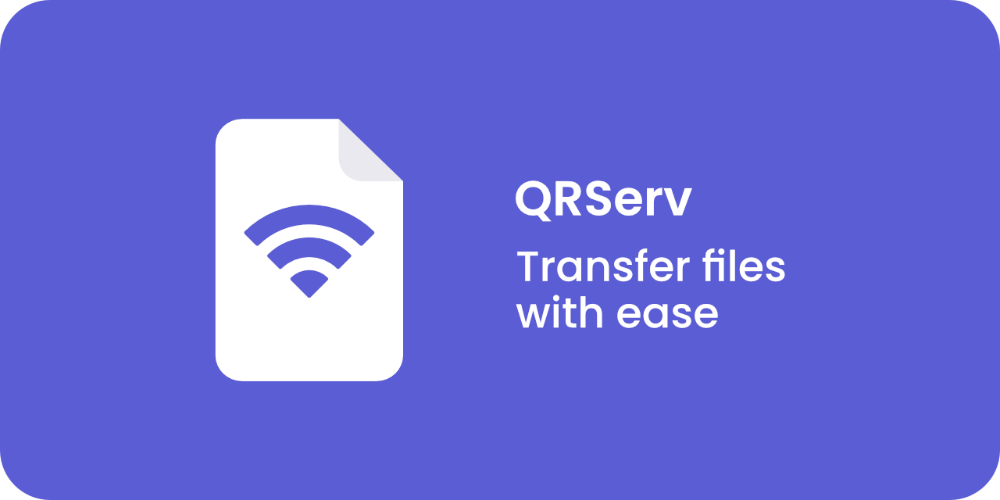

# QRServ

**NOTE:** THIS IS PRE-RELEASE SOFTWARE. PLEASE WAIT FOR IT TO BE FINALISED BEFORE USE (ETA: WITHIN THIS MONTH). OFFICIALLY COMPILED BUILDS ARE UNAVAILABLE FOR PUBLIC DURING THIS TIME.

**UPDATE 2:** After some time trying to prepare the app for null-safety, the unusual issue seemed to had been corrected. It should be ready soon as I work on helping sort out the null-safety migrations for a few required packages.

**UPDATE:** Due to a bug in the initial release of Flutter 2, an unknown component of the project is causing builds to fail regardless of the target platform. This is being looked into and will meanwhile further delay the release.

Transfer files with ease over a network.

[Play Store badge...]&nbsp;&nbsp;&nbsp;&nbsp;

 

    
Screenshots

     
    
    &nbsp;&nbsp;
    
    &nbsp;&nbsp;
    

 

## About

QRServ is a file sharing application that utilises its own HTTP server to serve files while having a clean & functional user interface.

## Features

- QR Code
- Various IP addresses from different network interfaces can be chosen
- HTTP server uses an unused ("random") port
- Animated user experience
- Supports Android and Windows platforms
- Supports various languages:
    - English
    - French (Français)
    - German (Deutsch)
    - Spanish (Español)
    - Portuguese (Português) 
    - Hungarian (Magyar)

## Releases

Android version is soon be made available on the Play Store...

All builds are to be finalised not too long from now. Keep an eye out.

~~Android and Windows builds can be found in the 'releases' section of this repository.~~

Note: Android builds on GitHub will have a different certificate than builds on the Play Store. In other words, you cannot upgrade a build from installation source A via source B and vice versa.

## Building

### Android

If you wish to have debugging symbols for an app bundle release, ensure you have the Android NDK installed. You may need to specify the `ndk.dir` in the `local.properties` file.
 
However, if you do not plan to do any Play Store release, you may remove the `ndk` block from `android.defaultConfig` in the gradle build file.

### Windows

Windows builds normally require `Visual C++ Redistributable for Visual Studio 2015` to run. There are two ways you could go about it:
1. Install [Visual C++ Redistributable for Visual Studio 2015](https://www.microsoft.com/en-us/download/details.aspx?id=48145)
2. Bundle the required files in the root directory of the compiled executable (`msvcp140.dll`, `vcruntime140.dll`, `vcruntime140_1.dll`) -- ideal when distributing

You could [package builds as a MSIX](https://pub.dev/packages/msix) but that is only practical if you plan to get or already have a code signing certificate.

## Licencing

[Legal attribution soon goes here...]

The '[MIT license](LICENSE)' is used for this project.

## Credits

| User                                        | Contribution          |
| ------------------------------------------- | --------------------- |
| [miklosakos](https://github.com/miklosakos) | Hungarian translation |
